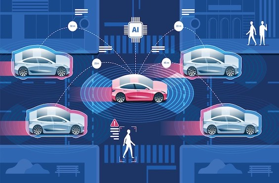

# IoT Hub Renault-Digital

[](https://www.gnu.org/licenses/agpl-3.0)




- Web-Site : http://robocars.diyrobocars.fr/

### Key benefits

- **Applicable** by including manufacturing specific business logics and applications (e.g., OEE analysis or Digital Shadow)
- **Reliable and Maintainable** through the usage of established IT and OT technologies
- **Scalable** across factories and clouds through a microservice approach and Docker container
- **Secure** by allowing to inspect and control each component to ensure confidentiality, integrity, and availability

### Hub Digital kick start website

```
docker build -t renaultdigital/bck_website .
docker run -ti --rm  -p 80:80 renaultdigital/hubdigital
```


### Technology & architecture
- MQTT Broker to connect with external devices
- Donkeycar Simulator gym

It can be deployed|
- in a federation (recommended), to allow each machine, production line and factory to work on its own without being reliant on external factors like internet connection
- centralized, e.g., "everything connected with the cloud"
- decentralized, e.g., "each machine is on its own"

## License

All source code is distributed under the GNU AFFERO GENERAL PUBLIC LICENSE. See [`LICENSE`](LICENSE) for more information. All other components (e.g. trademarks, images, logos, documentation, publications), especially those in the `/docs` folder, are property of the respective owner.

## Contact

DevSecOps Teams
