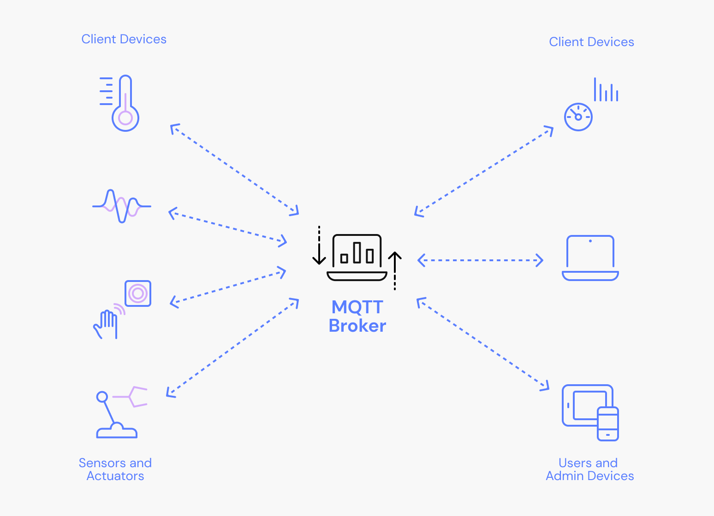

Eclipse Mosquitto
=================

Mosquitto is an open source implementation of a server for version 5.0, 3.1.1, 3.1
and 1.4 of the MQTT protocol. It also includes a C and C++ client library, and
the `mosquitto_pub` and `mosquitto_sub` utilities for publishing and
subscribing.


## Infra Details

[](img/broker.png)

## Links

See the following links for more information on MQTT:

- Community page: <http://mqtt.org/>
- MQTT v1.4 standard: <https://docs.oasis-open.org/mqtt/mqtt/v3.1.1/mqtt-v1.4.10.html>
- MQTT v3.1.1 standard: <https://docs.oasis-open.org/mqtt/mqtt/v3.1.1/mqtt-v3.1.1.html>
- MQTT v5.0 standard: <https://docs.oasis-open.org/mqtt/mqtt/v5.0/mqtt-v5.0.html>

Mosquitto project information is available at the following locations:

- Main homepage: <https://mosquitto.org/>
- Find existing bugs or submit a new bug: <https://github.com/eclipse/mosquitto/issues>
- Source code repository: <https://github.com/eclipse/mosquitto>

There is also a public test server available at <https://test.mosquitto.org/>

## Installing

See <https://mosquitto.org/download/> for details on installing binaries for
various platforms.

## Quick start

If you have installed a binary package the broker should have been started
automatically. If not, it can be started with a basic configuration:

    mosquitto

Then use `mosquitto_sub` to subscribe to a topic:

    mosquitto_sub -t 'test/topic' -v

And to publish a message:

    mosquitto_pub -t 'test/topic' -m 'hello world'


## Python lib paho.mqtt.python

The latest stable version is available in the Python Package Index (PyPi) and can be installed using

```
pip install paho-mqtt
Or with virtualenv:
```
```
virtualenv paho-mqtt
source paho-mqtt/bin/activate
pip install paho-mqtt
```
To obtain the full code, including examples and tests, you can clone the git repository:

git clone https://github.com/eclipse/paho.mqtt.python
Once you have the code, it can be installed from your repository as well:

cd paho.mqtt.python
python setup.py install
To perform test, you also need to clone paho.mqtt.testing in paho.mqtt.python folder:

git clone https://github.com/eclipse/paho.mqtt.testing.git

## Getting Started

Here is a very simple example that subscribes to the broker $SYS topic tree and prints out the resulting messages:

```
import paho.mqtt.client as mqtt

# The callback for when the client receives a CONNACK response from the server.
def on_connect(client, userdata, flags, rc):
    print("Connected with result code "+str(rc))

    # Subscribing in on_connect() means that if we lose the connection and
    # reconnect then subscriptions will be renewed.
    client.subscribe("$SYS/#")

# The callback for when a PUBLISH message is received from the server.
def on_message(client, userdata, msg):
    print(msg.topic+" "+str(msg.payload))

client = mqtt.Client()
client.on_connect = on_connect
client.on_message = on_message

client.connect("mqtt.eclipseprojects.io", 1883, 60)

# Blocking call that processes network traffic, dispatches callbacks and
# handles reconnecting.
# Other loop*() functions are available that give a threaded interface and a
# manual interface.
client.loop_forever()
```

## Docker service

```
version: '3'
services:

  mqtt:
    image: eclipse-mosquitto:version
    hostname: broker
    container_name: mqtt
    build:
      context: ./mqtt
      dockerfile: Dockerfile
    ports:
      - "1883:1883"
    volumes:
      - ./mqtt/config:/mosquitto/config
```
## Documentation

Documentation for the broker, clients and client library API can be found in
the man pages, which are available online at <https://mosquitto.org/man/>. There
are also pages with an introduction to the features of MQTT, the
`mosquitto_passwd` utility for dealing with username/passwords, and a
description of the configuration file options available for the broker.

Detailed client library API documentation can be found at <https://mosquitto.org/api/>

## Building from source

To build from source the recommended route for end users is to download the
archive from <https://mosquitto.org/download/>.

On Windows and Mac, use `cmake` to build. On other platforms, just run `make`
to build. For Windows, see also `README-windows.md`.

If you are building from the git repository then the documentation will not
already be built. Use `make binary` to skip building the man pages, or install
`docbook-xsl` on Debian/Ubuntu systems.

### Build Dependencies

* c-ares (libc-ares-dev on Debian based systems) - only when compiled with `make WITH_SRV=yes`
* cJSON - for client JSON output support. Disable with `make WITH_CJSON=no` Auto detected with CMake.
* libwebsockets (libwebsockets-dev) - enable with `make WITH_WEBSOCKETS=yes`
* openssl (libssl-dev on Debian based systems) - disable with `make WITH_TLS=no`
* pthreads - for client library thread support. This is required to support the
  `mosquitto_loop_start()` and `mosquitto_loop_stop()` functions. If compiled
  without pthread support, the library isn't guaranteed to be thread safe.
* uthash / utlist - bundled versions of these headers are provided, disable their use with `make WITH_BUNDLED_DEPS=no`
* xsltproc (xsltproc and docbook-xsl on Debian based systems) - only needed when building from git sources - disable with `make WITH_DOCS=no`

Equivalent options for enabling/disabling features are available when using the CMake build.


## Credits

Mosquitto was written by Roger Light <roger@atchoo.org>

Master: [](https://travis-ci.org/eclipse/mosquitto)
Develop: [](https://travis-ci.org/eclipse/mosquitto)
Fixes: [](https://travis-ci.org/eclipse/mosquitto)ÓÓ
